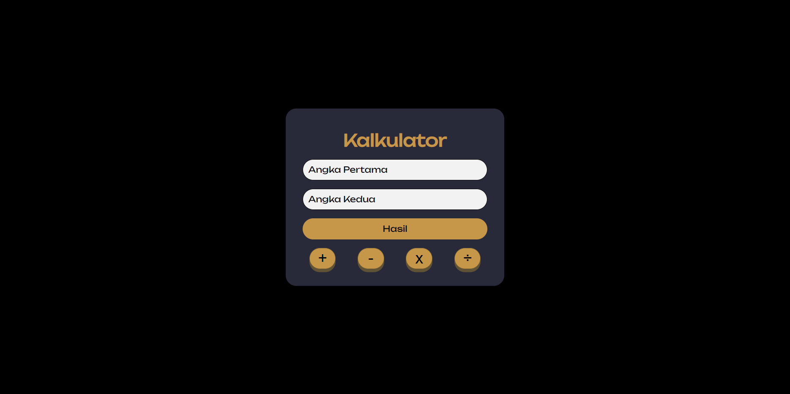

# Calculator Project (HTML CSS JS)

Project Calculator adalah sebuah proyek sekolah yang menggunakan HTML, CSS, dan JavaScript sebagai bahasa pemrograman utama. Proyek ini bertujuan untuk membuat kalkulator interaktif yang dapat digunakan untuk melakukan perhitungan matematika dasar. Dengan antarmuka yang menarik dan responsif, pengguna dapat memasukkan angka dan melakukan operasi seperti penjumlahan, pengurangan, perkalian, dan pembagian. Proyek ini memberikan kesempatan kepada siswa untuk mempraktikkan dan mengasah kemampuan mereka dalam menggunakan JavaScript untuk mengembangkan aplikasi web sederhana.

## Table of contents

- [Overview](#overview)
  - [Screenshot](#screenshot)
  - [Links](#links)
  - [Built with](#built-with)
- [Author](#author)

## Overview

### Screenshot

### Links

- Live Site URL: [Live Site](https://calculator-html-css-js-fxanz.vercel.app)

## Built with

- HTML 5
- CSS custom properties
- Flexbox

## Author

- Twitter - [@IFxanz](https://www.twitter.com/IFxanz)
